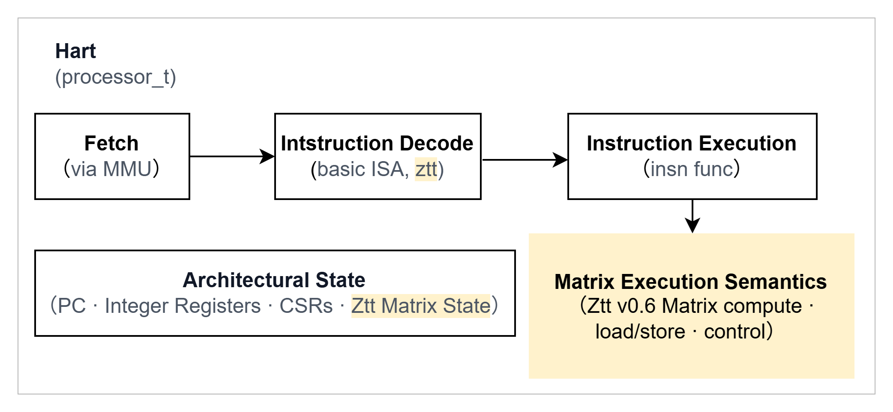

# AME_spike: AME Instruction Set Extension for Spike

AME_spike is an open-source functional simulation and validation environment built upon the Spike RISC-V ISA simulator, specifically designed to provide comprehensive support for the Attached Matrix Extension (AME) instruction set. It is our expectation that this Spike simulator will provide support for AME functional verification and validation. We actively encourage contributions from the broader community to collaboratively develop and refine this simulator, and thereby advance the implementation and validation of the AME extension.


## Key Features
- **AME Ztt v0.6 instruction types supported**
  - Resource Management
  - Datatype Management
  - Elementwise Arithmetic
  - Bitwise
  - Compare and Predication
  - Permutation
  - Register move / data conversion
  - Elementwise Math Functions
  - Memory
  - State Management
  - Matrix Multiply
  - Reduction

See the community release of spec Ztt v0.6 for details.

## Quick Start

### Prerequisites

  - C++20 compiler and standard Spike build dependencies, including GNU Make, dtc, Boost regex/system, and Git.
  - RISC-V GNU toolchain with binutils and libgcc.a.

### Build AME_spike

In the AME_spike root directory:

First, install the toolchain:

```sh
./scripts/build_toolchain.sh
```

Then, build AME_spike:

```sh
mkdir -p build
cd build
../configure
make -j"$(nproc)"
```
### Run examples and tests

Build and test an operator example:

```sh
make -C example gemm_fp32
```

Build and test all operators:

```sh
make -C example test
```

On Ubuntu 24.04.3 LTS, instruction, operator, and function-level tests pass.

## License

AME_spike code is distributed under the BSD three-clause license in [LICENSE](LICENSE). The original Spike code and its existing per-file copyrights remain covered by their original license terms and the notices in each file. Third-party components and the packaged AME RISC-V toolchain retain their own `LICENSE`, `COPYING`, or `NOTICE` terms.
